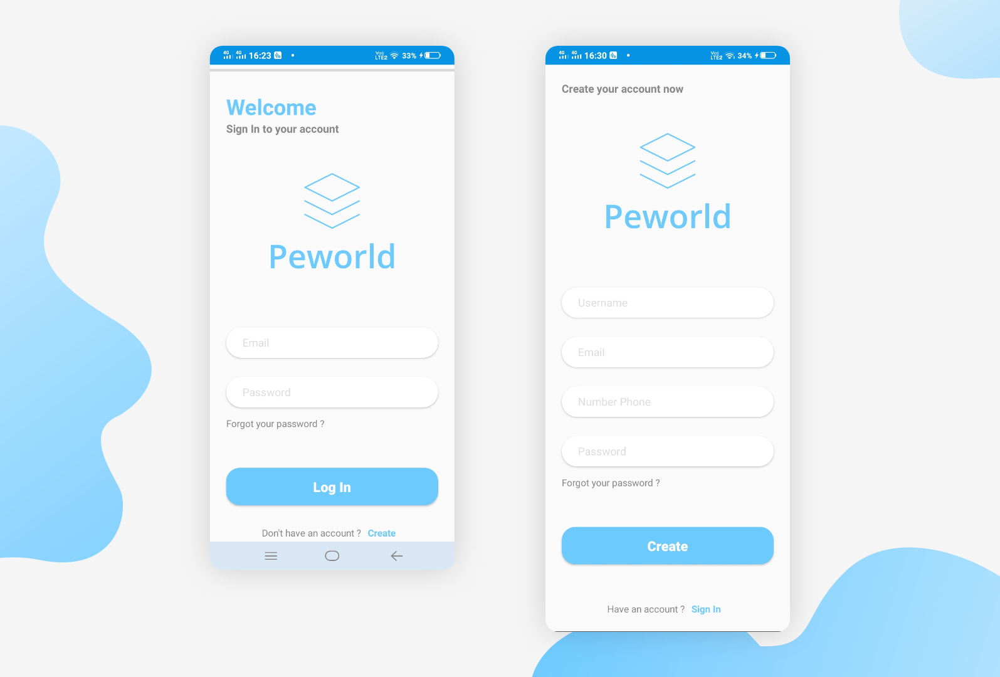
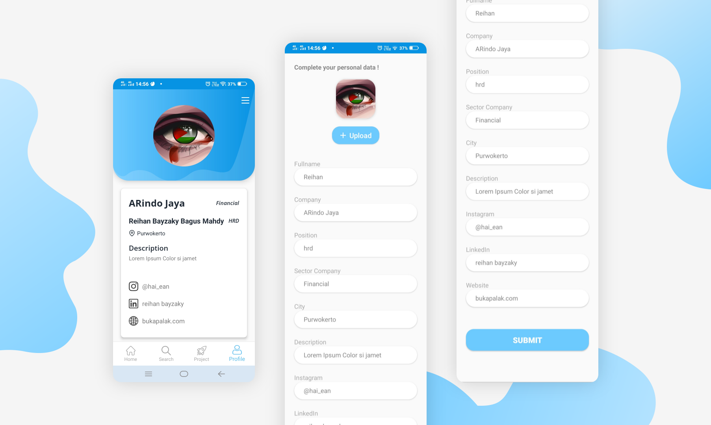
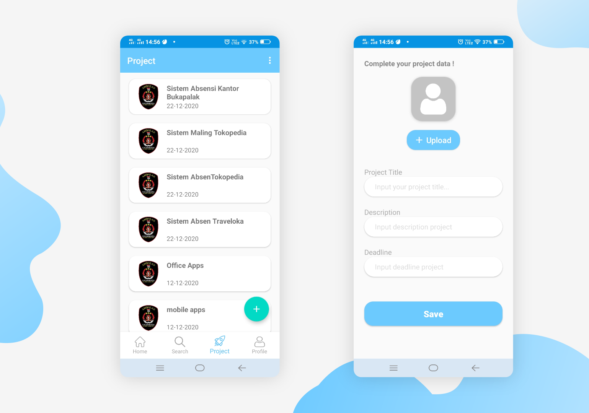

# Peworld - Hiring Apps 

 

## Peworld
Peworld is a android application to make jobseeking process so simple. Jobseeker can make their profile as excellent as their want, Company can search Jobseeker as same as their need 

This is a repository of Peworld Hire Job for Company or HeadHunter. It is build using Android Studio with program languange Kotlin, Fetch API with retrofit + coroutine, API using node.Js+Express.Js and Cloud Server with AWS Console

## Preview
#### Login & Register Page

#### Home & Search

#### Worker & Hire Transaction

#### Profile & Edit Profile

#### Project & Add Project

